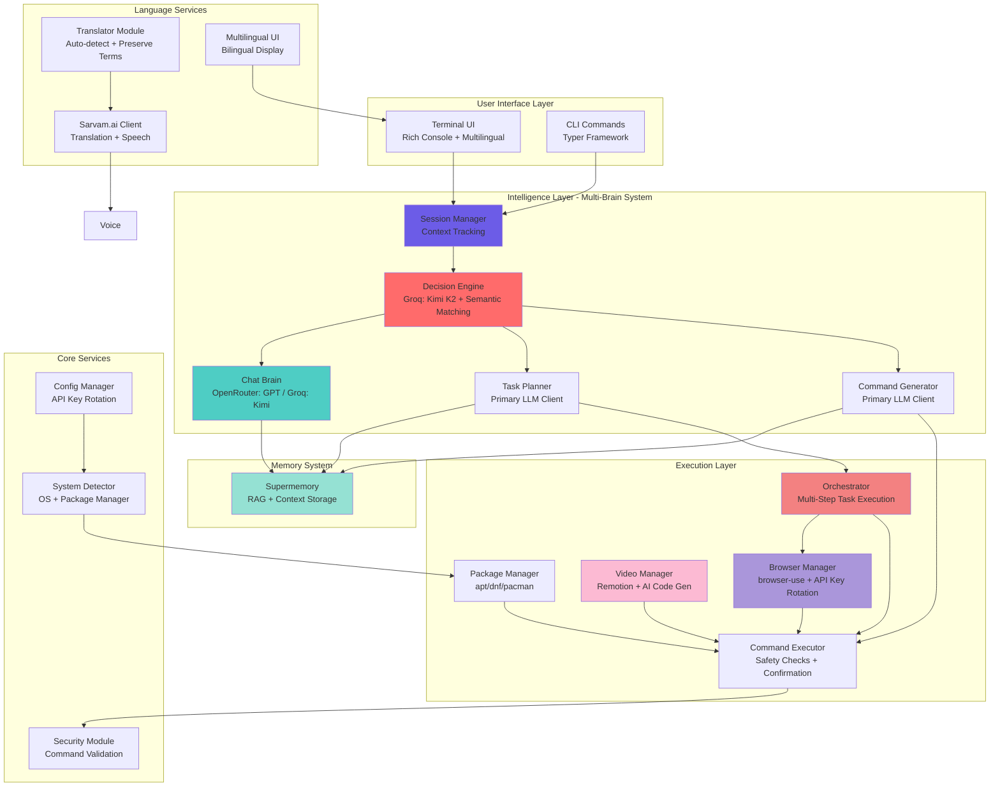
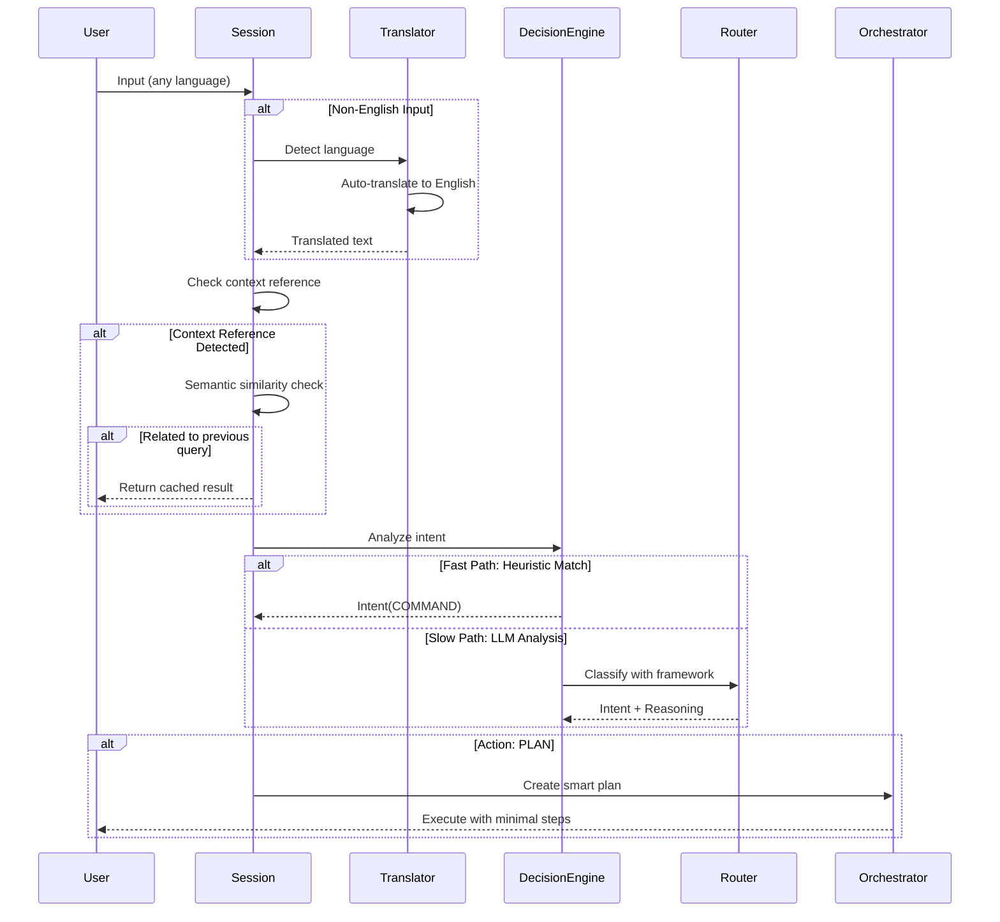
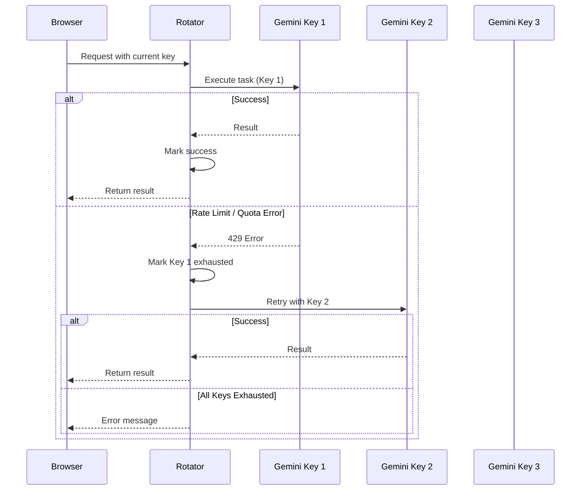

# Nexus - AI-Powered Linux Assistant

**Nexus** is an intelligent, terminal-based Linux assistant that combines multiple AI models, memory systems, and automation capabilities to help you manage your system, browse the web, generate videos, and execute complex tasks through natural language.

## ✨ Key Features

- 🧠 **Multi-Brain AI Architecture** - Specialized models for different tasks
- 🤖 **Autonomous Web Browsing** - Automated tasks with browser-use
- 🎬 **AI Video Generation** - Create videos from text descriptions
- 💾 **Persistent Memory** - RAG-based context retention with Supermemory
- 🔄 **Self-Healing Execution** - Auto-fix failed commands
- 🎯 **Intelligent Intent Recognition** - Context-aware decision making
- 🔐 **Security First** - Command validation and confirmation

## 🏗️ Architecture Overview

Nexus follows a modular, multi-brain architecture with robust decision-making:



## 🧠 AI Model Usage Map

Nexus uses different AI models for specialized tasks, creating an intelligent "multi-brain" system:

| Component | Model Used | Purpose | Why This Model? |
|-----------|------------|---------|-----------------|
| **Router / Decision Engine** | **Groq: Kimi K2** (`moonshotai/kimi-k2-instruct-0905`) | Fast intent classification & routing | Ultra-fast inference (⚡ Groq), robust decision framework |
| **Chat Brain** | **OpenRouter: GPT** (default) or **Groq: Kimi** | Natural language conversations | Best reasoning & context understanding |
| **Command Generator** | Primary LLM Client | Convert natural language → shell commands | Strong code generation capabilities |
| **Task Planner** | Primary LLM Client | Break complex tasks into steps | Strategic thinking & planning with smart CHECK logic |
| **Browser Agent** | **Gemini Flash** (`gemini-flash-latest`) | Web automation & navigation | Vision support + fast inference for UI understanding |
| **Video Code Generator** | **Gemini 2.5 Flash** | Generate React/Remotion code | Excellent at code generation with low latency |
| **Search Tool** | **Gemini 2.5 Flash** | Web search with citations | Native Google Search integration |

## 🎯 Intelligent Decision Making

### Enhanced Context-Aware System

Nexus features a **robust decision engine** with semantic understanding:

1. **Smart Context Detection**
   - Distinguishes between new requests and references to previous actions
   - "show me latest news in delhi" → NEW request (detailed query)
   - "show me that" → CONTEXT reference (pronoun-based)

2. **Semantic Similarity Matching**
   - Prevents false cache matches between unrelated queries
   - Uses keyword overlap (30% threshold) for relatedness
   - Example: Won't confuse "download video" with "show news"

3. **Intelligent Planning**
   - Distinguishes static (files) vs dynamic (news/weather) data
   - Only adds CHECK steps when logically appropriate
   - Minimal plans focused on user's actual request

See [ROBUSTNESS_FIXES.md](ROBUSTNESS_FIXES.md) for technical details.

## 📊 System Flow Diagrams

### 1. Enhanced User Input Processing Flow



### 3. API Key Rotation System



## 🔧 Component Details

### AI Clients (`src/jarvis/ai/`)

#### `llm_client.py` - LLM Abstraction Layer
- **`LLMClient`** (Abstract Base): Memory integration, prompt enrichment
- **`GoogleGenAIClient`**: Gemini models with Google Search grounding
- **`OpenRouterClient`**: Access to GPT models via OpenRouter
- **`GroqClient`**: Ultra-fast inference for routing decisions
- **`MockLLMClient`**: Fallback when no API keys configured

#### `decision_engine.py` - Intelligent Intent Classification
- **Enhanced Prompt**: Location awareness, news queries, trending data
- **Intelligent Analysis Framework**: Data Source → Location → Quantity → Complexity
- **Fast Path**: Regex-based heuristics for common commands
- **Slow Path**: LLM-based intent analysis with robust examples
- Routes to: COMMAND, CHAT, PLAN, SEARCH, BROWSE, VIDEO

#### `memory_client.py` - Supermemory Integration
- Stores: System context, command feedback, successful plans
- Retrieves: Relevant context for RAG-enhanced prompts
- Enables learning from past successes/failures

### Core Systems (`src/jarvis/core/`)

#### `session_manager.py` - Context & Cache Management (ENHANCED!)
- **Smart Context Detection**: Distinguishes new requests from references
- **Semantic Similarity**: 30% keyword overlap threshold
- **Recent History Tracking**: 10-minute context window

#### `orchestrator.py` - Multi-Step Task Execution (IMPROVED!)
- **Intelligent Planner**: Task-type recognition (data retrieval vs downloads)
- **Smart CHECK Logic**: Only when appropriate for static resources
- **Minimal Plans**: One step if possible, no over-engineering
- **Self-Healing**: Auto-fixes failed commands using LLM reflection
- **Live UI**: Real-time progress tracking with Rich tables

#### `api_key_rotator.py` - API Key Management (NEW!)
- Automatic rotation across multiple API keys
- Quota exhaustion detection (429, 404 errors)
- Success/failure tracking per key
- Configurable max retries

#### `executor.py` - Safe Command Execution
- Security checks via `SafetyCheck` module
- User confirmation for dangerous commands
- Dry-run mode support
- Interactive mode for tools like `apt`, `npm`

#### `config_manager.py` - Configuration Management
- Stores API keys, preferences in `~/.config/jarvis/config.json`
- Environment variable overrides
- Multiple API key support for rotation
- Language preferences

### Modules (`src/jarvis/modules/`)

#### `browser_manager.py` - Web Automation (ENHANCED!)
- **Local Mode**: browser-use library with Playwright
- **Cloud Mode**: BrowserUse SDK for headless execution
- **API Key Rotation**: Automatic failover on quota errors
- **Smart Downloads**: ~/Downloads tracking with pattern matching
- Uses Gemini Flash for vision-based UI understanding

#### `video_manager.py` - AI Video Generation
- Creates Remotion workspace automatically
- Generates React/TypeScript code using Gemini 2.5 Flash
- Validation loop: TypeScript compilation → Auto-fix → Retry
- Renders videos using Remotion CLI

#### `package_manager.py` - System Package Management
- Unified interface for apt/dnf/pacman
- Install, remove, update operations
- Automatic sudo handling

### UI Layer (`src/jarvis/ui/`)

#### `console_app.py` - Terminal User Interface (ENHANCED!)
- **Rich Console**: Panels, tables, markdown rendering
- **Prompt Toolkit**: Async input with syntax highlighting
- **Session Management**: Context-aware responses
- **Command Handlers**: `/video`, `/browse`, `/search`, etc.

#### `onboarding.py` - First-Run Setup
- Collects API keys (Google, OpenRouter, Groq)
- Configures Supermemory integration
- Multiple key support for rotation

## 🚀 Installation

### Prerequisites
- Python 3.10 or higher
- Node.js (for video generation)
- Supported OS: Ubuntu, Debian, Fedora, Arch Linux

### Setup

1. **Clone the repository**:
   ```bash
   git clone <repository-url>
   cd nexus
   ```

2. **Create virtual environment**:
   ```bash
   python3 -m venv .venv
   source .venv/bin/activate
   ```

3. **Install package**:
   ```bash
   pip install -e .
   ```

4. **Configure API keys**:
   ```bash
   cp .env.example .env
   # Edit .env and add your API keys
   ```

5. **Run onboarding** (first-time only):
   ```bash
   nexus
   ```

### Optional: Voice Support

For voice commands, install PyAudio:

```bash
# Ubuntu/Debian
sudo apt-get install portaudio19-dev python3-pyaudio

# Then install Python dependencies
pip install -r requirements.txt
```

### Global Access

Add to `~/.bashrc` or `~/.zshrc`:
```bash
alias nexus='/path/to/nexus/.venv/bin/nexus'
```

## 📖 Usage

### Interactive Mode (TUI)
```bash
nexus
```
Launches the full Terminal UI with decision engine and memory support.

### CLI Commands

#### Chat
```bash
nexus chat "How do I check disk space?"
```

#### Package Management
```bash
nexus install htop
nexus remove firefox
nexus update
```

#### Natural Language Execution
```bash
nexus do "find all python files larger than 1MB"
```

#### Browser Automation
```bash
nexus browse "Find MrBeast on YouTube"
nexus browse --cloud "Download latest Chrome .deb"
```

#### Video Generation
```bash
nexus video "Create a 5-second countdown timer"
```

#### Web Search
```bash
nexus search "best restaurants in Dubai"
```

## 🧪 Advanced Features

### Robust Context Management
- Semantic understanding prevents false cache matches
- Distinguishes new requests from context references
- Keyword-based similarity checking (30% threshold)
- 10-minute context window for recent actions

### Intelligent Task Planning
- Data type awareness (static vs dynamic)
- Minimal step generation
- Appropriate use of CHECK steps
- Focus on user's actual intent

### API Key Rotation
- Automatic failover across multiple keys
- Quota exhaustion detection
- Per-key success/failure tracking
- Supports up to 4 keys per service

### Memory System
Nexus remembers:
- **System Context**: OS, package manager
- **Command Feedback**: Success/failure of past commands
- **Proven Plans**: Multi-step tasks that worked
- **User Preferences**: Language, learned from interactions

### Self-Healing Execution
If a command fails, Nexus:
1. Analyzes the error
2. Asks LLM to fix the command
3. Retries automatically

## 🔐 Security

### Safety Checks
- Blocks destructive commands (`rm -rf /`)
- Requires confirmation for sudo operations
- Validates commands before execution
- Dry-run mode available

### Configuration
```bash
# Enable dry-run mode
export JARVIS_DRY_RUN=1

# Disable confirmations (not recommended)
# Set dangerous_mode: true in config
```

## 📁 Project Structure

```
nexus/
├── src/jarvis/
│   ├── ai/                    # AI clients and intelligence
│   │   ├── llm_client.py      # Model abstractions
│   │   ├── command_generator.py
│   │   ├── decision_engine.py  # Enhanced with robust logic
│   │   └── memory_client.py
│   ├── core/                  # Core systems
│   │   ├── orchestrator.py    # Smart planning (IMPROVED!)
│   │   ├── session_manager.py # Context tracking (ENHANCED!)
│   │   ├── api_key_rotator.py # Key rotation (NEW!)
│   │   ├── executor.py
│   │   ├── config_manager.py
│   │   ├── system_detector.py
│   │   └── security.py
│   ├── modules/               # Feature modules
│   │   ├── browser_manager.py # With key rotation
│   │   ├── video_manager.py
│   │   └── package_manager.py
│   ├── ui/                    # User interfaces
│   │   ├── console_app.py     # TUI with multilingual
│   │   └── onboarding.py
│   └── main.py               # CLI entry point
├── pyproject.toml
├── README.md                 # This file
├── ROBUSTNESS_FIXES.md       # Architecture improvements
├── test_robustness_fixes.py  # Validation tests
└── .env.example              # Environment template
```

## 🔑 Environment Variables

| Variable | Purpose | Required |
|----------|---------|----------|
| `GOOGLE_API_KEY` | Gemini models, search | For search feature |
| `GOOGLE_API_KEY_2`, `_3`, `_4` | Key rotation | Optional |
| `OPENROUTER_API_KEY` | GPT models via OpenRouter | For best chat quality |
| `GROQ_API_KEY` | Fast routing decisions | Optional (fallback) |
| `SUPERMEMORY_API_KEY` | Memory/RAG system | Optional |
| `BROWSER_USE_API_KEY` | Cloud browser automation | Optional |

## 🧪 Testing

Run robustness validation tests:

```bash
python3 test_robustness_fixes.py
```

Tests cover:
- Session manager context detection
- Semantic similarity matching
- Decision engine heuristics
- Prompt quality validation

## 🛣️ Roadmap

Recent Additions:
- ✅ API key rotation system
- ✅ Robust context management
- ✅ Intelligent task planning
- ✅ Semantic similarity matching

Coming Soon:
- 🔄 AppImage support
- 🔄 .deb file installation
- 🔄 MCP (Model Context Protocol) integration
- 🔄 Git assistant
- 🔄 Docker management
- 🔄 Natural language cron jobs
- 🔄 More language support (beyond Indic)

See [plan.md](plan.md) for detailed roadmap.

## 📚 Documentation

- [ROBUSTNESS_FIXES.md](ROBUSTNESS_FIXES.md) - Architecture improvements & technical details
- [TESTING_GUIDE.md](TESTING_GUIDE.md) - Testing procedures
- [API_KEY_ROTATION_GUIDE.md](API_KEY_ROTATION_GUIDE.md) - Key rotation setup

## 🤝 Contributing

Contributions are welcome! This project is actively developed.

Areas for contribution:
- Additional language support
- New AI model integrations
- Enhanced security features
- Performance optimizations

## 📄 License

[Add your license here]

## 👤 Author

Created by Garvit (garvitjoshi543@gmail.com)

---

**Nexus** - Your intelligent Linux companion, powered by multiple AI brains working in harmony.
