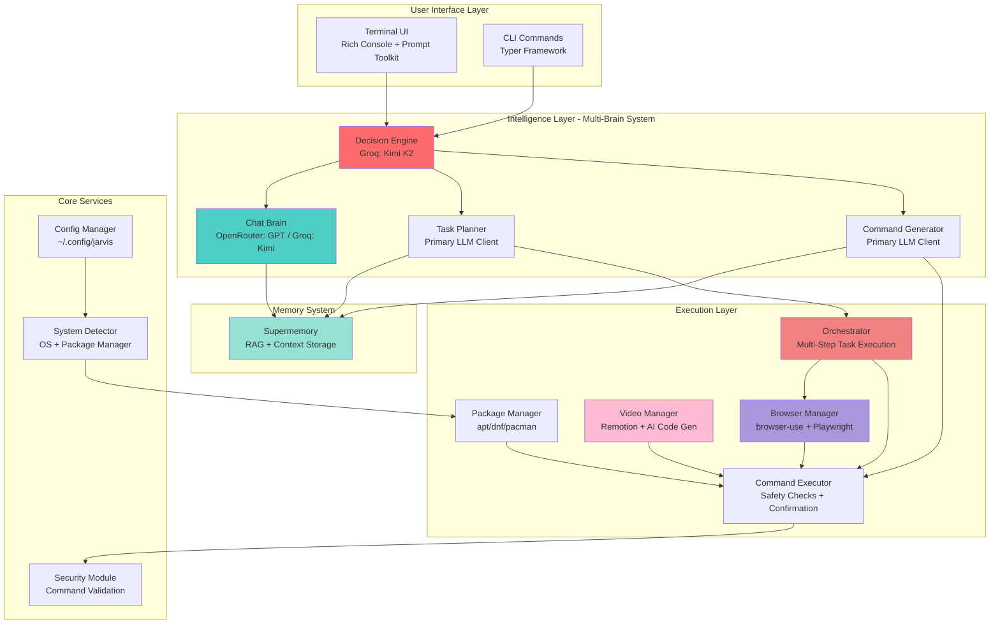
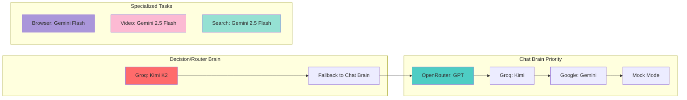
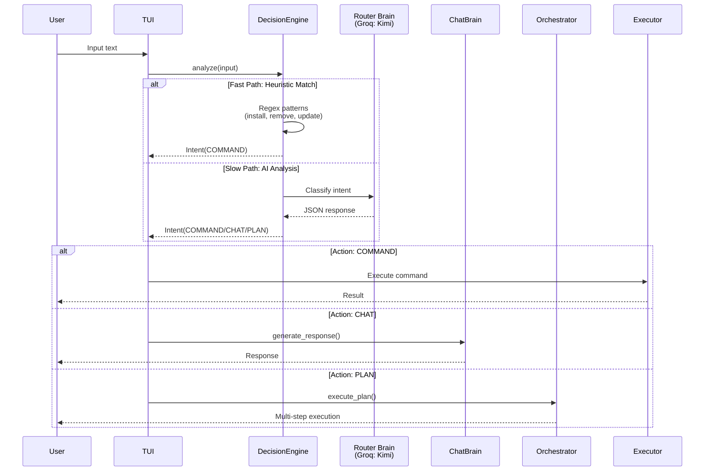
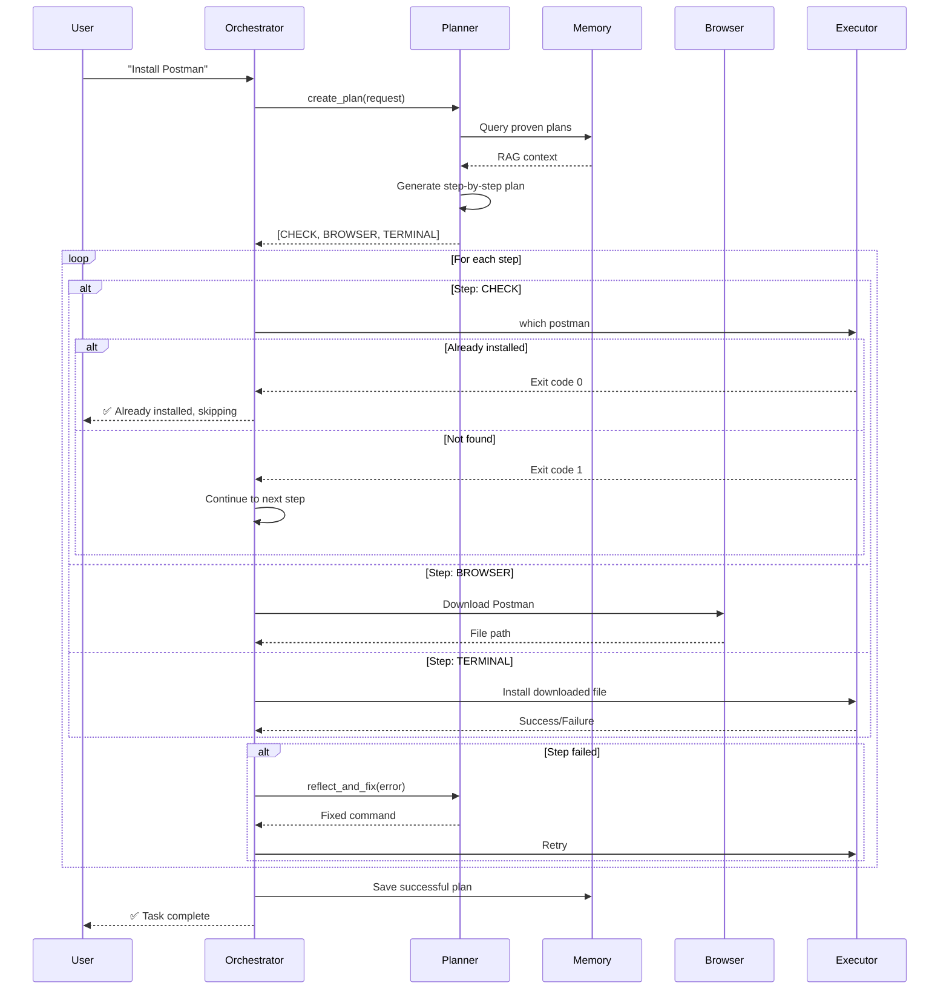
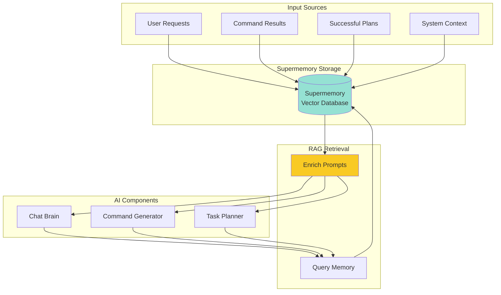

# Nexus - AI-Powered Linux Assistant

**Nexus** is an intelligent, terminal-based Linux assistant that combines multiple AI models, memory systems, and automation capabilities to help you manage your system, browse the web, generate videos, and execute complex tasks through natural language.

## 🏗️ Architecture Overview

Nexus follows a modular, multi-brain architecture where different AI models handle specialized tasks:



## 🧠 AI Model Usage Map

Nexus uses different AI models for different purposes, creating a specialized "multi-brain" system:

| Component | Model Used | Purpose | Why This Model? |
|-----------|------------|---------|-----------------|
| **Router / Decision Engine** | **Groq: Kimi K2** (`moonshotai/kimi-k2-instruct-0905`) | Fast intent classification & routing | Ultra-fast inference (⚡ Groq), perfect for real-time decisions |
| **Chat Brain** | **OpenRouter: GPT** (default) or **Groq: Kimi** (fallback) | Natural language conversations | Best reasoning & context understanding |
| **Command Generator** | Primary LLM Client (OpenRouter/Groq/Gemini) | Convert natural language → shell commands | Needs strong code generation capabilities |
| **Task Planner** | Primary LLM Client (OpenRouter/Groq/Gemini) | Break complex tasks into steps | Requires strategic thinking & planning |
| **Browser Agent** | **Gemini Flash** (`gemini-flash-latest`) via `browser-use` | Web automation & navigation | Vision support + fast inference for UI understanding |
| **Video Code Generator** | **Gemini 2.5 Flash** | Generate React/Remotion code | Excellent at code generation with low latency |
| **Search Tool** | **Gemini 2.5 Flash** (with Google Search grounding) | Web search with citations | Native Google Search integration |

### Model Priority System



## 📊 System Flow Diagrams

### 1. User Input Processing Flow



### 2. Complex Task Orchestration Flow



### 3. Memory System Integration



## 🔧 Component Details

### AI Clients (`src/jarvis/ai/`)

#### `llm_client.py` - LLM Abstraction Layer
- **`LLMClient`** (Abstract Base): Memory integration, prompt enrichment
- **`GoogleGenAIClient`**: Gemini models with Google Search grounding
- **`OpenRouterClient`**: Access to GPT models via OpenRouter
- **`GroqClient`**: Ultra-fast inference for routing decisions
- **`MockLLMClient`**: Fallback when no API keys configured

#### `command_generator.py` - Natural Language → Shell Commands
- Converts user requests to executable shell commands
- Uses RAG to retrieve proven solutions from memory
- Implements safety guidelines and idempotency principles

#### `decision_engine.py` - Intent Classification
- **Fast Path**: Regex-based heuristics for common commands
- **Slow Path**: LLM-based intent analysis (JSON structured output)
- Routes to: COMMAND, CHAT, PLAN, SEARCH, BROWSE, VIDEO

#### `memory_client.py` - Supermemory Integration
- Stores: System context, command feedback, successful plans, user preferences
- Retrieves: Relevant context for RAG-enhanced prompts
- Enables learning from past successes/failures

### Core Systems (`src/jarvis/core/`)

#### `orchestrator.py` - Multi-Step Task Execution
- **Planner**: Breaks complex requests into steps (CHECK → BROWSER → TERMINAL)
- **Smart Resume**: Checks if files already exist before downloading
- **Self-Healing**: Auto-fixes failed commands using LLM reflection
- **Live UI**: Real-time progress tracking with Rich tables

#### `executor.py` - Safe Command Execution
- Security checks via `SafetyCheck` module
- User confirmation for dangerous commands
- Dry-run mode support
- Interactive mode for tools like `apt`, `npm`

#### `config_manager.py` - Configuration Management
- Stores API keys, preferences in `~/.config/jarvis/config.json`
- Environment variable overrides
- Onboarding state tracking

#### `system_detector.py` - OS Detection
- Detects: Ubuntu, Debian, Fedora, Arch, etc.
- Identifies package manager: apt, dnf, pacman
- Provides system context to AI models

### Modules (`src/jarvis/modules/`)

#### `browser_manager.py` - Web Automation
- **Local Mode**: `browser-use` library with Playwright (headless=false for live view)
- **Cloud Mode**: BrowserUse SDK for headless execution
- Smart download handling (~/Downloads tracking)
- Uses Gemini Flash for vision-based UI understanding

#### `video_manager.py` - AI Video Generation
- Creates Remotion workspace automatically
- Generates React/TypeScript code using Gemini 2.5 Flash
- Validation loop: TypeScript compilation → Auto-fix → Retry
- Renders videos using Remotion CLI

#### `package_manager.py` - System Package Management
- Unified interface for apt/dnf/pacman
- Install, remove, update operations
- Automatic sudo handling

### UI Layer (`src/jarvis/ui/`)

#### `console_app.py` - Terminal User Interface
- **Rich Console**: Panels, tables, markdown rendering
- **Prompt Toolkit**: Async input with syntax highlighting
- **Decision Engine Integration**: Auto-routes commands vs chat
- **Command Handlers**: `/video`, `/browse`, `/search`, `/install`, etc.

#### `onboarding.py` - First-Run Setup
- Collects API keys (Google, OpenRouter, Groq)
- Configures Supermemory integration
- Saves to config file

## 🚀 Installation

### Prerequisites
- Python 3.10 or higher
- Node.js (for video generation)
- Supported OS: Ubuntu, Debian, Fedora, Arch Linux

### Setup

1. **Clone the repository**:
   ```bash
   git clone <repository-url>
   cd nexus
   ```

2. **Create virtual environment**:
   ```bash
   python3 -m venv .venv
   source .venv/bin/activate
   ```

3. **Install package**:
   ```bash
   pip install -e .
   ```

4. **Configure API keys**:
   ```bash
   cp .env.example .env
   # Edit .env and add your API keys
   ```

5. **Run onboarding** (first-time only):
   ```bash
   nexus
   ```

### Global Access

Add to `~/.bashrc` or `~/.zshrc`:
```bash
alias nexus='/path/to/nexus/.venv/bin/nexus'
```

## 📖 Usage

### Interactive Mode (TUI)
```bash
nexus
```
Launches the full Terminal UI with decision engine, memory, and all features.

### CLI Commands

#### Chat
```bash
nexus chat "How do I check disk space?"
```

#### Package Management
```bash
nexus install htop
nexus remove firefox
nexus update
```

#### Natural Language Execution
```bash
nexus do "find all python files larger than 1MB"
```

#### Browser Automation
```bash
nexus browse "Find MrBeast on YouTube"
nexus browse --cloud "Download latest Chrome .deb"
```

#### Video Generation
```bash
nexus video "Create a 5-second countdown timer"
```

#### Web Search
```bash
nexus search "best restaurants in Dubai"
```

## 🧪 Advanced Features

### Memory System
Nexus remembers:
- **System Context**: OS, package manager
- **Command Feedback**: Success/failure of past commands
- **Proven Plans**: Multi-step tasks that worked
- **User Preferences**: Learned from interactions

### Multi-Step Task Planning
Example: "Install Postman"
1. **CHECK**: `which postman` (idempotency)
2. **BROWSER**: Download from official site
3. **TERMINAL**: Extract and install

### Self-Healing Execution
If a command fails, Nexus:
1. Analyzes the error
2. Asks LLM to fix the command
3. Retries automatically

### Smart Download Tracking
- Monitors `~/Downloads` for new files
- Filters out `.crdownload`, `.part`, `.tmp`
- Injects filenames into subsequent commands

## 🔐 Security

### Safety Checks
- Blocks destructive commands (`rm -rf /`)
- Requires confirmation for sudo operations
- Validates commands before execution
- Dry-run mode available

### Configuration
```bash
# Enable dry-run mode
export JARVIS_DRY_RUN=1

# Disable confirmations (not recommended)
# Set dangerous_mode: true in config
```

## 📁 Project Structure

```
nexus/
├── src/jarvis/
│   ├── ai/                    # AI clients and intelligence
│   │   ├── llm_client.py      # Model abstractions
│   │   ├── command_generator.py
│   │   ├── decision_engine.py
│   │   └── memory_client.py
│   ├── core/                  # Core systems
│   │   ├── orchestrator.py    # Multi-step execution
│   │   ├── executor.py        # Command execution
│   │   ├── config_manager.py
│   │   ├── system_detector.py
│   │   └── security.py
│   ├── modules/               # Feature modules
│   │   ├── browser_manager.py
│   │   ├── video_manager.py
│   │   └── package_manager.py
│   ├── ui/                    # User interfaces
│   │   ├── console_app.py     # TUI
│   │   └── onboarding.py
│   └── main.py               # CLI entry point
├── pyproject.toml
└── README.md
```

## 🔑 Environment Variables

| Variable | Purpose | Required |
|----------|---------|----------|
| `GOOGLE_API_KEY` | Gemini models, search | For search feature |
| `OPENROUTER_API_KEY` | GPT models via OpenRouter | For best chat quality |
| `GROQ_API_KEY` | Fast routing decisions | Optional (fallback to others) |
| `SUPERMEMORY_API_KEY` | Memory/RAG system | Optional |
| `BROWSER_USE_API_KEY` | Cloud browser automation | Optional |

## 🛣️ Roadmap

See [plan.md](plan.md) for detailed future features:
- ✅ Multi-brain AI architecture
- ✅ Memory system integration
- ✅ Browser automation
- ✅ Video generation
- 🔄 AppImage support
- 🔄 .deb file installation
- 🔄 MCP (Model Context Protocol) integration
- 🔄 Git assistant
- 🔄 Docker management
- 🔄 Natural language cron jobs

## 🤝 Contributing

Contributions are welcome! This project is actively developed.

## 📄 License

[Add your license here]

## 👤 Author

Created by Garvit (garvitjoshi543@gmail.com)

---

**Nexus** - Your intelligent Linux companion, powered by multiple AI brains working in harmony.
