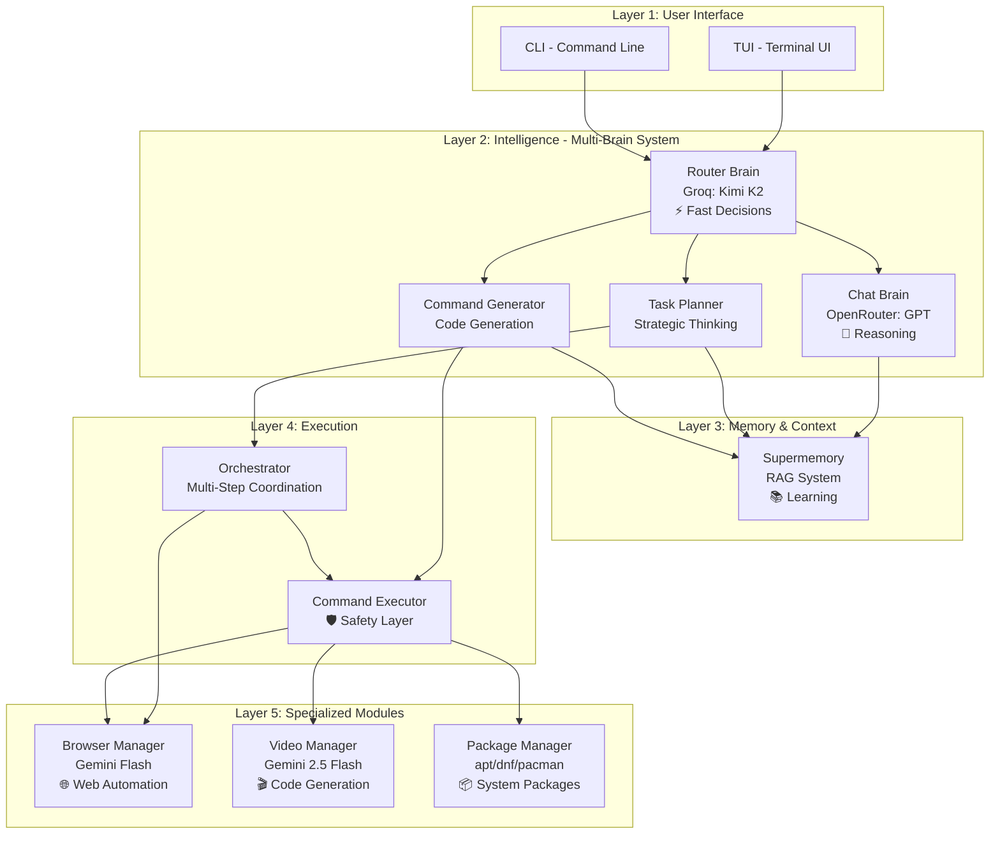
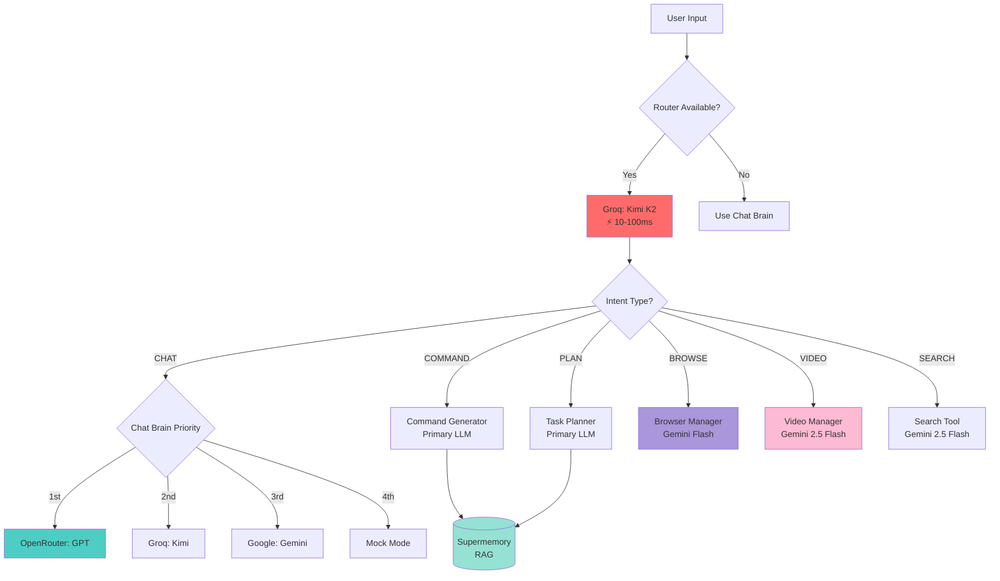
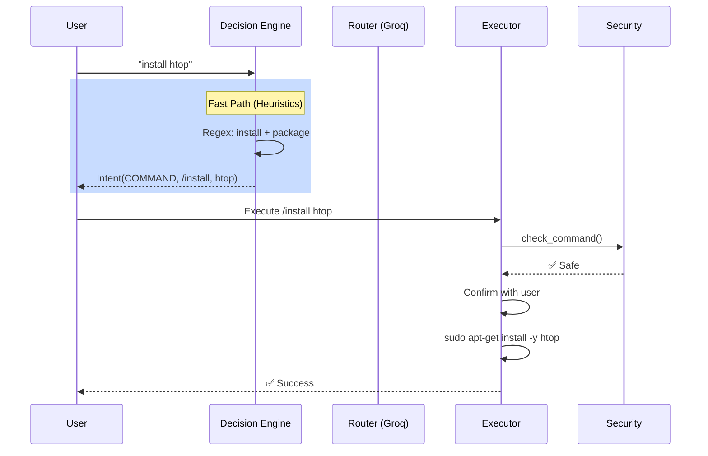
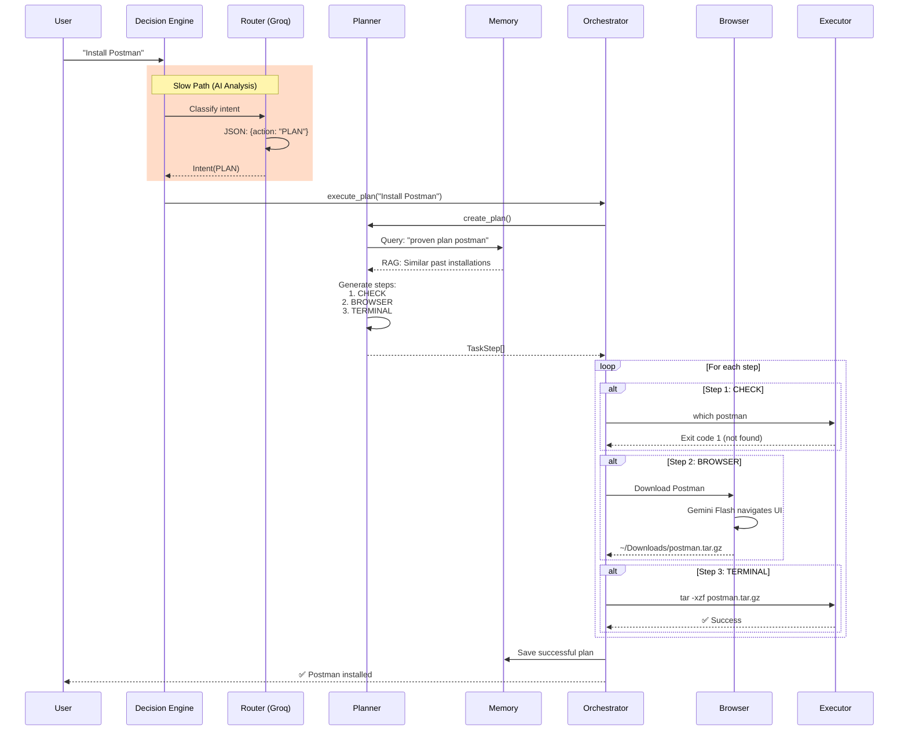
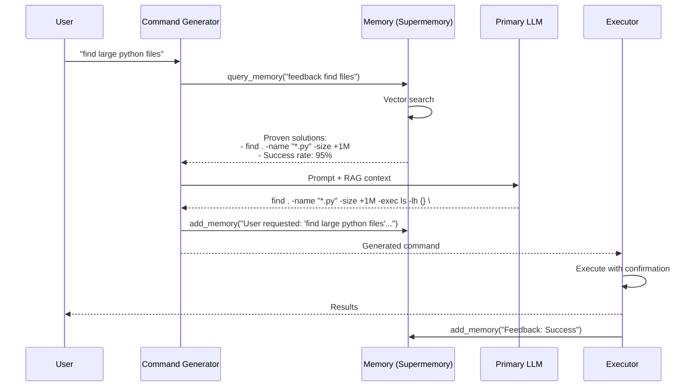
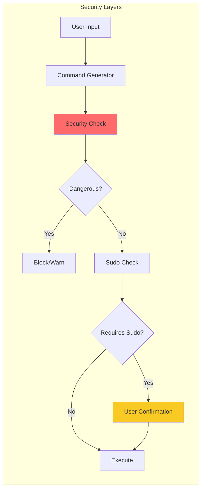

# Nexus Architecture Overview

This document provides a detailed architectural analysis of the Nexus AI-powered Linux assistant.

## System Architecture

Nexus implements a sophisticated multi-brain AI architecture where specialized models handle different cognitive tasks, similar to how different parts of the human brain specialize in different functions.

### Component Hierarchy



## AI Model Distribution

### The Multi-Brain Philosophy

Nexus doesn't rely on a single AI model. Instead, it uses specialized models for different cognitive tasks:

| Brain Component | Model | Strengths | Use Cases |
|----------------|-------|-----------|-----------|
| **Limbic System (Router)** | Groq: Kimi K2 | Ultra-fast inference (10-100ms) | Intent classification, quick decisions |
| **Cortex (Chat)** | OpenRouter: GPT-4o | Deep reasoning, context understanding | Complex conversations, explanations |
| **Motor Cortex (Commands)** | Primary LLM | Code generation, shell expertise | Natural language → shell commands |
| **Prefrontal Cortex (Planning)** | Primary LLM | Strategic thinking, task breakdown | Multi-step task orchestration |
| **Visual Cortex (Browser)** | Gemini Flash | Vision + fast inference | Web UI understanding, automation |
| **Creative Cortex (Video)** | Gemini 2.5 Flash | Code generation, low latency | React/Remotion code generation |

### Model Selection Logic



## Data Flow Analysis

### 1. Simple Command Execution



### 2. Complex Task with Planning



### 3. Memory-Enhanced Command Generation



## Key Design Patterns

### 1. Idempotency in Task Planning

Every complex task starts with a CHECK step:

```python
# Example plan for "Install Postman"
[
  {
    "action": "CHECK",
    "command": "which postman",
    "description": "Check if already installed"
  },
  # If CHECK succeeds (exit code 0), skip remaining steps
  {
    "action": "BROWSER",
    "command": "Download Postman...",
  },
  {
    "action": "TERMINAL",
    "command": "tar -xzf <DOWNLOADED_FILE>",
  }
]
```

### 2. Self-Healing Execution

When a command fails, Nexus attempts auto-recovery:

```python
# Orchestrator.py - reflect_and_fix()
if step.status == "failed":
    error_context = f"{step.output}\n(Context: {context})"
    fixed_command = llm.generate_response(
        f"Fix this command: {step.command}\nError: {error_context}"
    )
    # Retry with fixed command
```

### 3. Smart Download Tracking

Browser downloads are automatically tracked and injected:

```python
# Orchestrator.py - _wait_for_download()
before_files = set(os.listdir("~/Downloads"))
# ... browser downloads file ...
after_files = set(os.listdir("~/Downloads"))
new_file = (after_files - before_files)[0]

# Inject into next step
step.command = step.command.replace("<DOWNLOADED_FILE>", new_file)
```

### 4. RAG-Enhanced Prompts

All AI interactions are enriched with memory:

```python
# llm_client.py - enrich_prompt()
def enrich_prompt(self, prompt: str) -> str:
    if self.memory_client:
        context = self.memory_client.query_memory(prompt[:500])
        return f"--- MEMORY CONTEXT ---\n{context}\n\n{prompt}"
    return prompt
```

## Security Architecture



### Safety Checks

1. **Blacklist Patterns**: Blocks `rm -rf /`, `dd if=/dev/zero`, etc.
2. **Sudo Detection**: Auto-adds `sudo` for system operations
3. **User Confirmation**: Required for all potentially dangerous operations
4. **Dry-Run Mode**: Test commands without execution

## Performance Characteristics

| Operation | Latency | Model Used | Notes |
|-----------|---------|------------|-------|
| Intent Classification | 10-100ms | Groq: Kimi K2 | Ultra-fast routing |
| Simple Chat | 500ms-2s | OpenRouter: GPT | Depends on model |
| Command Generation | 1-3s | Primary LLM | Includes RAG lookup |
| Task Planning | 2-5s | Primary LLM | Complex reasoning |
| Browser Automation | 10-60s | Gemini Flash | Depends on task |
| Video Generation | 30-120s | Gemini 2.5 Flash | Code gen + render |

## Technology Stack

### Core Technologies
- **Language**: Python 3.10+
- **CLI Framework**: Typer
- **UI Library**: Rich + Prompt Toolkit
- **Async**: asyncio

### AI/ML
- **LLM Clients**: google-genai, openai, groq
- **Browser Automation**: browser-use, playwright
- **Memory**: supermemory (RAG)
- **Video**: Remotion (React/TypeScript)

### System Integration
- **Package Detection**: distro
- **Config Management**: JSON + environment variables
- **Security**: Custom validation layer

## Future Architecture Enhancements

### Planned Improvements

1. **MCP Integration**: Model Context Protocol for extended tooling
2. **Plugin System**: Modular skill extensions
3. **Distributed Execution**: Remote command execution
4. **Advanced Memory**: Hierarchical memory with forgetting curves
5. **Multi-Agent Collaboration**: Specialized sub-agents for domains

---

**Architecture Philosophy**: Nexus combines the speed of heuristics, the intelligence of multiple AI models, and the reliability of hardcoded logic to create a robust, intelligent assistant that learns and improves over time.
