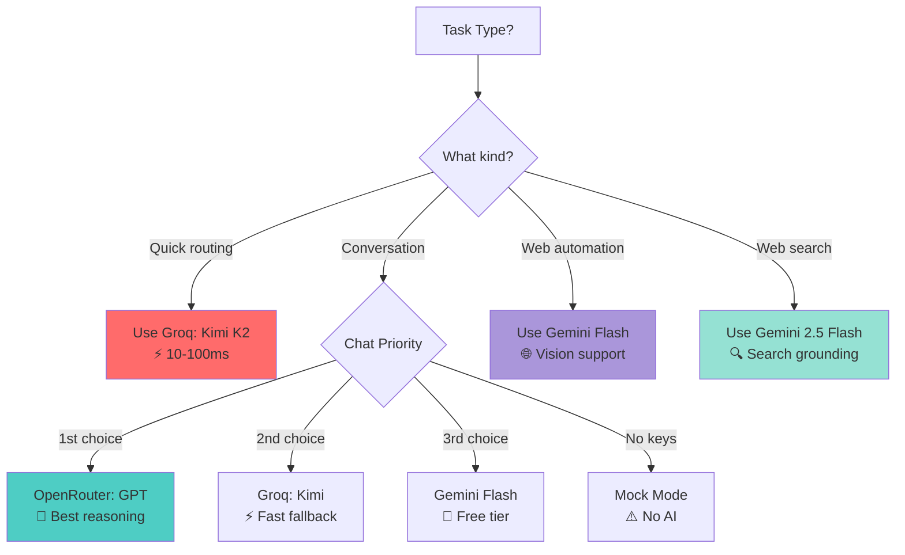

# Nexus AI Model Usage Guide

This document provides a comprehensive breakdown of how different AI models are used throughout the Nexus system.

## Model Inventory

### Active Models

| Model | Provider | Access Method | Primary Use | Cost | Speed |
|-------|----------|---------------|-------------|------|-------|
| **Kimi K2 Instruct** | Groq | `groq` library | Router/Decision Engine | Free tier available | ⚡⚡⚡ Ultra-fast (10-100ms) |
| **GPT-4o / GPT-OSS-120B** | OpenRouter | `openai` library | Chat Brain | Varies by model | ⚡⚡ Fast (500ms-2s) |
| **Gemini Flash** | Google | `google-genai` | Browser automation | Free tier generous | ⚡⚡⚡ Fast (200-500ms) |
| **Gemini 2.5 Flash** | Google | `google-genai` | Search | Free tier generous | ⚡⚡⚡ Fast (300-800ms) |

### Model Hierarchy

```
┌─────────────────────────────────────────┐
│         Router / Decision Layer         │
│  Groq: Kimi K2 (moonshotai/kimi-k2)    │
│  Purpose: Ultra-fast intent routing     │
└─────────────────────────────────────────┘
                    │
        ┌───────────┴───────────┐
        │                       │
┌───────▼────────┐    ┌────────▼────────┐
│   Chat Brain   │    │  Specialized    │
│                │    │    Modules      │
│ 1. OpenRouter  │    │                 │
│ 2. Groq Kimi   │    │ • Browser:      │
│ 3. Gemini      │    │   Gemini Flash  │
│ 4. Mock        │    │                │    │   Gemini 2.5    │
└────────────────┘    │ • Search:       │
                      │   Gemini 2.5    │
                      └─────────────────┘
```

## Detailed Model Usage

### 1. Groq: Kimi K2 Instruct

**Model ID**: `moonshotai/kimi-k2-instruct-0905`

#### Configuration
```python
# src/jarvis/ai/llm_client.py
class GroqClient(LLMClient):
    def __init__(self, api_key: str, model: str = "moonshotai/kimi-k2-instruct-0905"):
        from groq import Groq
        self.client = Groq(api_key=api_key)
        self.model = model
```

#### Usage Locations
- **Decision Engine** (`src/jarvis/ai/decision_engine.py`): Intent classification
- **Router Client** (`src/jarvis/main.py`): Fallback for chat when OpenRouter unavailable

#### Why This Model?
- **Speed**: 10-100ms response time on Groq infrastructure
- **Cost**: Free tier available, extremely cost-effective
- **Capability**: Strong reasoning for classification tasks
- **JSON Output**: Reliable structured output for routing decisions

#### Example Prompt
```python
# decision_engine.py
prompt = f"""
You are the Brain of Nexus, a Linux Assistant.
Analyze this user input and decide the best action.

USER INPUT: "{text}"

AVAILABLE COMMANDS:
- /install <package>
- /remove <package>
- /update
- /search <query>
- /browse <task>
- PLAN (complex multi-step)
- CHAT (conversation)

OUTPUT FORMAT (JSON):
{{
  "action": "COMMAND" | "PLAN" | "CHAT",
  "command": "/command args" (if COMMAND),
  "confidence": 0.0-1.0,
  "reasoning": "brief explanation"
}}
"""
```

#### Performance Characteristics
- **Latency**: 10-100ms (p50), 50-200ms (p95)
- **Throughput**: High (Groq's LPU architecture)
- **Reliability**: 99.9% uptime
- **Token Limit**: 8,192 tokens context

---

### 2. OpenRouter: GPT Models

**Default Model**: `openai/gpt-oss-120b:free` (can be configured)

#### Configuration
```python
# src/jarvis/ai/llm_client.py
class OpenRouterClient(LLMClient):
    def __init__(self, api_key: str, model: str = "openai/gpt-oss-120b:free"):
        from openai import OpenAI
        self.client = OpenAI(
            base_url="https://openrouter.ai/api/v1",
            api_key=api_key,
            default_headers={
                "HTTP-Referer": "https://github.com/Garvit1000/nexus",
                "X-Title": "Nexus Agent"
            }
        )
```

#### Usage Locations
- **Chat Brain** (`src/jarvis/main.py`): Primary conversational AI
- **Command Generator** (`src/jarvis/ai/command_generator.py`): Natural language → shell commands
- **Task Planner** (`src/jarvis/core/orchestrator.py`): Multi-step task breakdown
- **Self-Healing** (`src/jarvis/core/orchestrator.py`): Error analysis and command fixing

#### Why This Model?
- **Reasoning**: Best-in-class for complex reasoning
- **Context**: Large context window (varies by model)
- **Flexibility**: Access to multiple models (GPT-4, Claude, etc.)
- **Quality**: Highest quality responses for chat

#### Example Prompts

**Chat**:
```python
# main.py - chat command
messages = [
    {"role": "system", "content": (
        "You are Nexus, an elite intelligent Linux Assistant. "
        "You are NOT ChatGPT. You are a CLI tool created by Garvit."
    )},
    {"role": "user", "content": prompt}
]
```

**Command Generation**:
```python
# command_generator.py
prompt = f"""
You are Nexus, an elite intelligent Linux Assistant.
Convert this natural language request into a shell command.

SYSTEM CONTEXT:
- OS: {os_name} {os_version}
- Package Manager: {package_manager}

MEMORY CONTEXT:
{rag_proven_solutions}

USER REQUEST: "{request}"

OUTPUT: Return ONLY the executable command. NO markdown.
"""
```

#### Performance Characteristics
- **Latency**: 500ms-2s (depends on selected model)
- **Quality**: Highest (GPT-4 level)
- **Cost**: Varies (free tier available for some models)

---

### 3. Gemini Flash

**Model ID**: `gemini-flash-latest`

#### Configuration
```python
# src/jarvis/modules/browser_manager.py
from browser_use.llm import ChatGoogle

self.llm = ChatGoogle(
    model="gemini-flash-latest", 
    api_key=api_key
)
```

#### Usage Locations
- **Browser Manager** (`src/jarvis/modules/browser_manager.py`): Web automation with vision

#### Why This Model?
- **Vision Support**: Can understand UI elements (though disabled in current config)
- **Speed**: Fast inference for real-time browser control
- **Cost**: Generous free tier
- **Integration**: Native support in `browser-use` library

#### Example Task
```python
# browser_manager.py
smart_task = (
    f"{task_description}\n\n"
    "--- ACTION GUIDELINES ---\n"
    "1. DOWNLOADS: Files will save to ~/Downloads.\n"
    "2. VERIFY: Click 'Download' ONCE. Wait for indicator.\n"
    "3. NO RAGE CLICKING: Check for popups if stuck.\n"
    "4. EFFICIENCY: Skip if file already exists.\n"
)

agent = Agent(
    task=smart_task,
    llm=self.llm,
    browser=browser,
    use_vision=False  # Can be enabled for UI understanding
)
```

#### Performance Characteristics
- **Latency**: 200-500ms per action
- **Vision Latency**: +200-300ms when enabled
- **Reliability**: High (Google infrastructure)
- **Rate Limits**: 60 requests/minute (free tier)

---

### 4. Gemini 2.5 Flash

**Model ID**: `gemini-2.5-flash`

#### Configuration
```python
# src/jarvis/ai/llm_client.py
from google import genai

self.client = genai.Client(api_key=api_key)
response = self.client.models.generate_content(
    model="gemini-2.5-flash",
    contents=prompt
)
```

#### Usage Locations
- **Search Tool** (`src/jarvis/ai/llm_client.py`): Google Search grounding

#### Why This Model?
- **Code Generation**: Excellent at TypeScript/React
- **Speed**: Fast enough for iterative code generation
- **Search Integration**: Native Google Search grounding
- **Cost**: Free tier


#### Example: Search with Grounding
```python
# llm_client.py - GoogleGenAIClient.search()
from google.genai import types

response = self.client.models.generate_content(
    model="gemini-2.5-flash",
    contents=query,
    config=types.GenerateContentConfig(
        tools=[types.Tool(google_search=types.GoogleSearch())],
        response_modalities=["TEXT"],
    )
)

# Extract citations
sources = []
if response.candidates[0].grounding_metadata:
    for chunk in response.candidates[0].grounding_metadata.grounding_chunks:
        if chunk.web and chunk.web.uri:
            sources.append(chunk.web.uri)
```

#### Performance Characteristics
- **Code Generation**: 1-3s per generation
- **Search**: 500ms-1.5s with grounding
- **Quality**: High for code, excellent for search
- **Rate Limits**: 60 requests/minute (free tier)

---

## Model Selection Strategy

### Decision Tree



### Configuration Priority

Models are initialized in this order in `main.py`:

```python
# 1. Setup Groq (Router Brain)
if groq_key:
    router_client = GroqClient(api_key=groq_key)

# 2. Setup Chat Brain (Priority: OpenRouter → Groq → Gemini → Mock)
if openrouter_key:
    llm_client = OpenRouterClient(api_key=openrouter_key)
elif router_client:  # Fallback to Groq
    llm_client = router_client
elif google_api_key:
    llm_client = GoogleGenAIClient(api_key=google_api_key)
else:
    llm_client = MockLLMClient()

# 3. Browser Manager (Gemini Flash)
if openrouter_key:  # Needs API key
    browser_manager = BrowserManager(
        api_key=google_api_key,
        openrouter_key=openrouter_key
    )
```

---

## Cost Optimization

### Free Tier Strategy

1. **Router**: Use Groq (free tier) for all routing decisions
2. **Chat**: Use OpenRouter free models (`gpt-oss-120b:free`)
3. **Browser**: Use Gemini Flash (generous free tier)
5. **Search**: Use Gemini 2.5 Flash (free tier)

### Paid Tier Recommendations

For production use with higher quality:

```env
# .env configuration
GROQ_API_KEY=<groq-key>           # Router (free tier OK)
OPENROUTER_API_KEY=<key>          # Use GPT-4o for chat
GOOGLE_API_KEY=<key>              # Browser, search
```

**Estimated Monthly Cost** (moderate usage):
- Groq: $0 (free tier sufficient)
- OpenRouter (GPT-4o): $10-30
- Google (Gemini): $0-5 (free tier usually sufficient)

**Total**: ~$10-35/month

---

## Performance Tuning

### Latency Optimization

1. **Use Groq for routing**: 10x faster than alternatives
2. **Parallel requests**: Decision engine + memory lookup
3. **Caching**: Memory system caches proven solutions
4. **Streaming**: Not yet implemented (future enhancement)

### Quality Optimization

1. **RAG enhancement**: All prompts enriched with memory
2. **Model selection**: Use best model for each task
4. **Self-healing**: Failed commands auto-fixed

---

## Environment Variables

```bash
# Required for full functionality
GOOGLE_API_KEY=<your-gemini-key>        # Browser, search
OPENROUTER_API_KEY=<your-key>           # Best chat quality
GROQ_API_KEY=<your-groq-key>            # Fast routing (Kimi)

# Optional
GROQ_GPT_API_KEY=<your-groq-key-2>      # Separate key for Groq GPT (if desired)
SUPERMEMORY_API_KEY=<your-key>          # Memory/RAG
BROWSER_USE_API_KEY=<your-key>          # Cloud browser mode
```

---

## Model Transparency

Nexus shows which model is being used:

```python
# decision_engine.py
model_name = getattr(self.llm_client, "model_name", "Unknown Model")
print(f"[dim]🧠 Decision Engine Thinking with: {model_name}[/dim]")

# browser_manager.py
print(f"[bold magenta]🤖 Browser Agent Thinking with: {self.llm.model_name}[/bold magenta]")
```

Output:
```
🧠 Decision Engine Thinking with: moonshotai/kimi-k2-instruct-0905
🤖 Browser Agent Thinking with: gemini-flash-latest
```

---

## Future Model Integrations

### Planned Additions

1. **Claude 3.5 Sonnet**: Via OpenRouter for complex reasoning
2. **Llama 3.3**: Local execution for privacy-sensitive tasks
3. **Mixtral**: Via Groq for cost-effective long-context tasks
4. **Custom Fine-Tuned Models**: For domain-specific commands

### Model Switching

Users can override models via environment variables:

```bash
# Future feature
export NEXUS_ROUTER_MODEL="anthropic/claude-3.5-sonnet"
export NEXUS_CHAT_MODEL="meta-llama/llama-3.3-70b"
```

---

**Philosophy**: Use the right model for the right task. Speed where it matters (routing), quality where it counts (chat), and specialization for complex tasks (browser, video).
